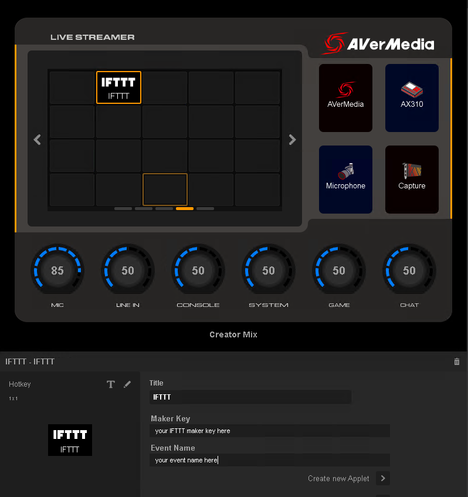

## IFTTT Webhooks for AVerMedia Creator Central

	

### Description
Add IFTTT Webhooks widgets to your Creator Central.

### Guide
- [English](Release/Guide_en-US.md)
- [繁體中文](Release/Guide_zh-TW.md)

### Installation
- Download [our prebuilt package](Release/IFTTT.creatorCentral) and use Creator Central Widget Import feature

### License
Copyright 2021-2022 AVerMedia Technologies Inc. and respective authors and developers.
This source code is licensed under the MIT-style license found in the [LICENSE](LICENSE) file.
